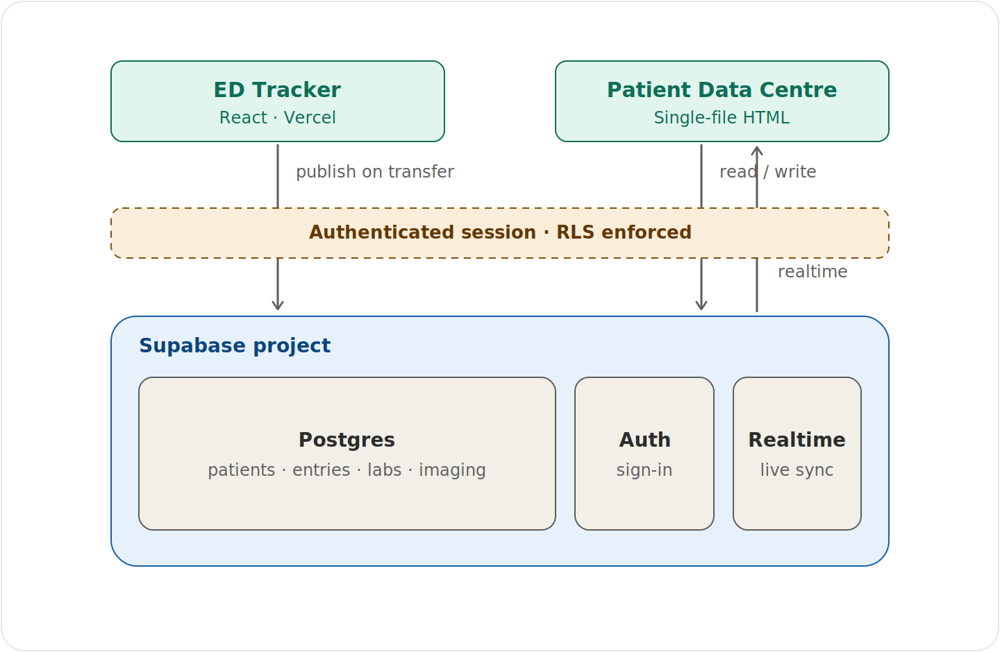

# ED Tracker


A live emergency-department tracking board with AI-assisted clerking, signed clinical entries, and a real **admit-to-ward handover** into a shared clinical record.

**Live demo:** https://ed-tracker-seven.vercel.app

> ⚠️ **Synthetic data only.** This is a portfolio/demo project, not a medical device, and is not for real patient data.

See [DECISIONS.md](DECISIONS.md) for the engineering trade-offs behind this system.

---

## What it does

- **ED board** — patients with triage category (Red/Amber/Green), live time-in-department timers, and department stats.
- **NEWS2** — structured observation entry with live score, risk banding, and a trend chart (Scale 1 / Scale 2).
- **Structured bloods** — FBC, U&Es, LFTs, inflammatory markers, other markers, and blood gas, with separate sample/results timestamps.
- **Signed entries** — notes, NEWS, and bloods are committed via a password re-confirmation step and stamped with the clinician's name and role.
- **AI assist (Claude)** — auto-fill observations and presenting complaint from a free-text clerking, and generate a discharge summary.
- **Admit to ward** — publishes the patient and their full ED record into a shared **Patient Data Centre** (the ward record). This simulates an HL7 **ADT^A02** transfer.

## Architecture



## Ward integration (shared backend)

ED Tracker and the Patient Data Centre are two separate apps that share **one Supabase (Postgres) project**.

- ED Tracker keeps its own fast local board (`localStorage`). It is not continuously synced.
- At the moment of transfer, `src/lib/wardDb.js` publishes the patient into the shared `patients`, `entries`, `labs`, and `imaging` tables:
  - notes → timeline notes
  - NEWS history → NEWS entries
  - bloods → lab panels
  - imaging request → a "requested" imaging study
  - plus an ED → ward transfer event (which drives the ward's Journey/time-in-ED view)
- **Realtime** — the ward record updates live (no refresh) when a patient is admitted.
- **Auth + Row Level Security** — the shared tables have RLS enabled; only an authenticated session can read or write. ED Tracker signs in as a "ward system" account before publishing.

## Tech stack

React 19 · Vite · Supabase (Postgres, Auth, Realtime) · Anthropic API (Claude) · jsPDF

## Local development

1. Install dependencies:
```bash
   npm install
```
2. Run the dev server:
```bash
   npm run dev
```

The AI features call the serverless functions in `api/`, which require an Anthropic API key set as an environment variable in your deployment (see the `api/*.js` files for the exact name they expect).

The Supabase project URL and **publishable** key are set in `src/lib/wardDb.js` (the publishable key is safe to expose in client code). Writing to the shared ward database requires a sign-in: the first time you admit a patient, ED Tracker prompts for a ward (Supabase) account. Create one in the Supabase dashboard (Authentication → Users → Add user) with **"Auto Confirm User"** ticked. The session is remembered for the rest of the browser session.

## Security & governance notes

- **Synthetic data only.** RLS on a free-tier Supabase project does not meet NHS information-governance requirements (DSPT / DPIA / Caldicott) for real patient data.
- **No long-lived credentials in the client.** Writes to the shared ward database run under a short-lived Supabase session — the clinician signs in at runtime (a prompt on first admit), and the write is authorised by Row Level Security as an authenticated user. No password or privileged key is baked into the shipped bundle.
- Access control is "any authenticated clinician can access the shared ward record" — the correct model for a shared ward. Finer-grained, role-based policies would be the next step toward production.

## Project structure

```
src/
  App.jsx              Central state and handlers
  components/          UI (PatientDetail, AddPatientModal, BloodsModal,
                       NewsChart, NotesHistory, BloodsHistory, ...)
  lib/
    auth.js            In-app clinician login / signing identity
    llm.js             Calls to the AI serverless functions
    news.js            NEWS2 scoring
    time.js            Time helpers
    wardDb.js          The ward bridge (Supabase client + sendPatientToWard)
api/                   Serverless functions for the Claude calls
```
